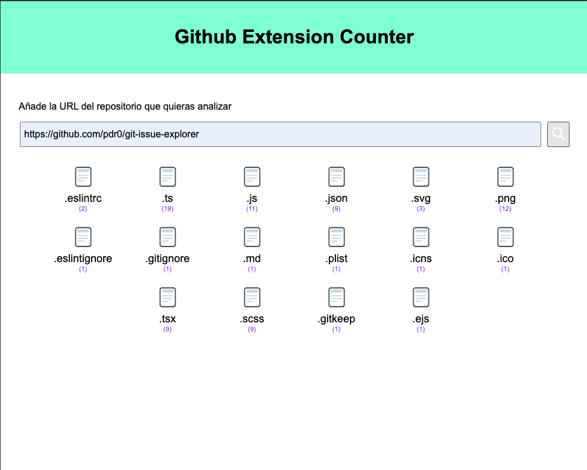
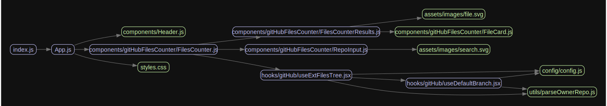

# GitHub Repository File Extensions Counter

## Overview

The GitHub Repository File Extensions Counter is a small application designed to provide insights into the distribution of file extensions within a specified GitHub repository. By providing the owner's username and the repository name, the application fetches the repository's contents from the GitHub API and generates a list of file extensions along with their respective counts.

## Features

- Fetches repository contents from GitHub API.
- Parses file extensions and counts their occurrences.
- Displays a list of file extensions and their counts.

## Usage

To use the GitHub Repository File Extensions Counter, follow these steps:

1. **Clone the Repository:**
   Clone the repository to your local machine using the following command:
   `git clone https://github.com/yourusername/github-file-extensions-counter.git`

2. **Install Dependencies:**
   Navigate to the project directory and install the necessary dependencies:
   cd github-file-extensions-counter
   pnpm i

3. **Run the Application:**
   !Keep in mind you need to add your access token onto .env file!
   Run the application:
   `npm run start`

4. **View Results:**
   Once the application has completed execution, it will display a list of file extensions along with their counts.

## Example

Consider a GitHub repository owned by `exampleuser` with the name `example-repo`. To analyze the file extensions in this repository, put the following repo url onto the input field:
`https://github.com/pdr0/git-issue-explorer`

The application will retrieve the repository contents, parse the file extensions, and display the results.

## Requirements

- Node.js
- GitHub account with access to the desired repository
- Github personal access token

## License

This project is licensed under the MIT License - see the [LICENSE](LICENSE) file for details.

## Contributing

Contributions are welcome! Please feel free to open an issue or submit a pull request.

---

## Tech Stack

### Frontend

- **React**: A JavaScript library for building user interfaces.
  - Version: ^18.2.0
- **React DOM**: React package for working with the DOM.
  - Version: ^18.2.0

### HTTP Requests

- **Axios**: Promise-based HTTP client for the browser and Node.js.
  - Version: ^0.26.1

### Testing

- **React Testing Library**: Testing utilities for React components.
  - Version: ^13.4.0
  - **@testing-library/react-hooks**: Custom hooks testing utilities.
    - Version: ^8.0.1
  - **@testing-library/jest-dom**: Custom Jest matchers for DOM elements.
    - Version: ^5.17.0
  - **@testing-library/user-event**: Simulate user events for testing.
    - Version: ^13.5.0

## Scripts

- **start**: Start the development server.
  - Command: `npm run start`
- **build**: Build the application for production.
  - Command: `npm run build`
- **test**: Run tests with coverage reporting.
  - Command: `npm run test `

